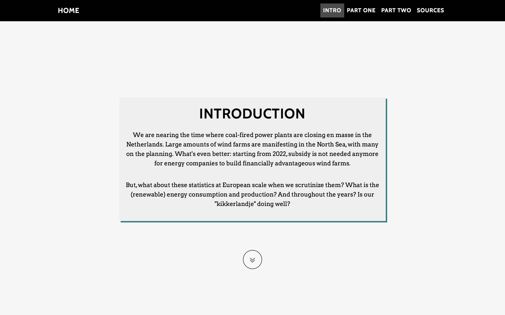
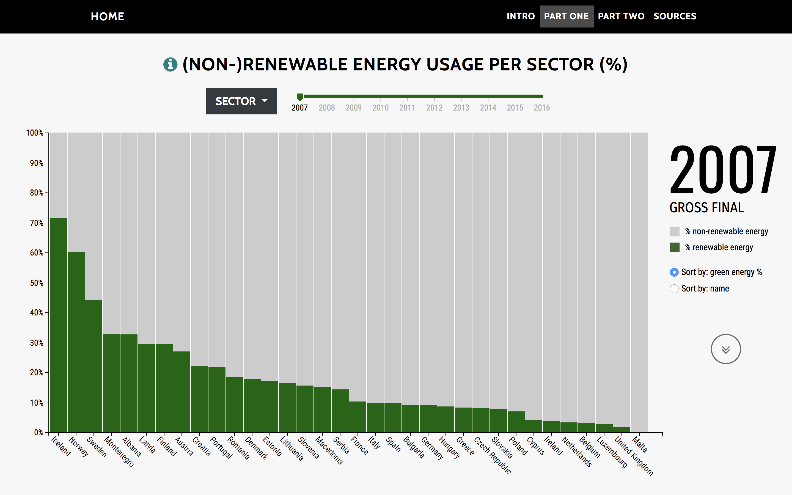
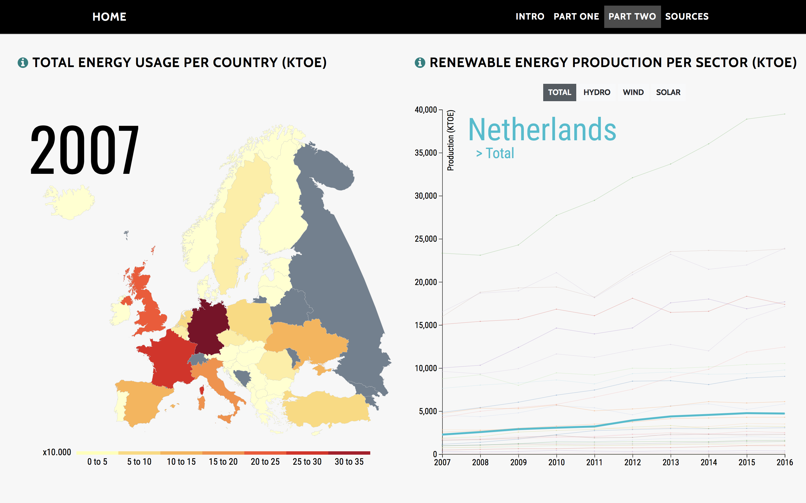
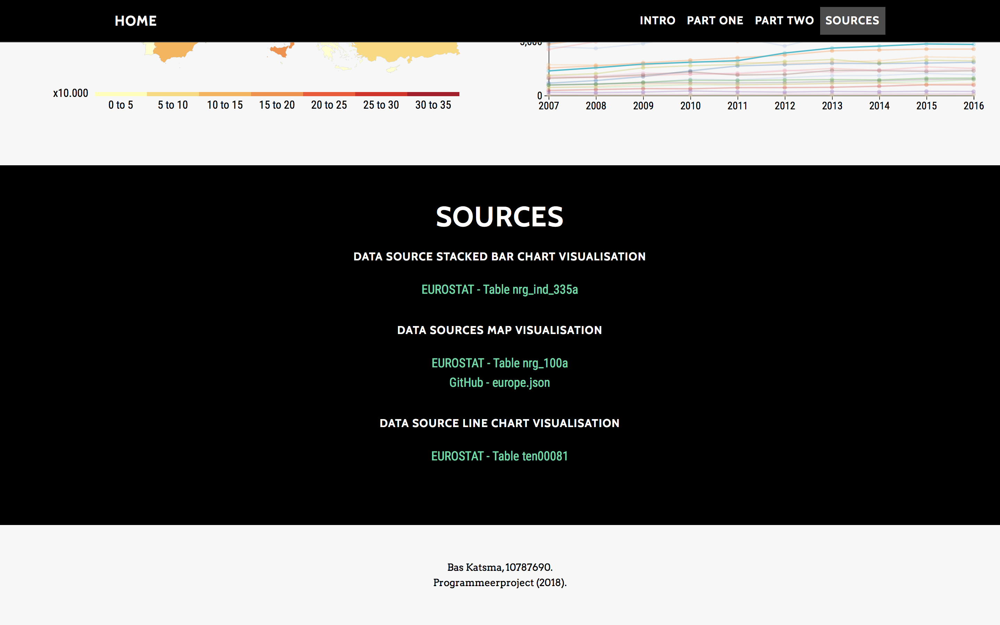

# Europe: Life in \#008000
### Programmeerproject 2018
**Naam**: Bas Katsma. \
**Studentnummer**: 10787690.

#### << [Bezoek de website!](https://baskatsma.github.io/Programmeerproject/project/index.html) >>

## Doel
Dit programmeerproject laat met behulp van interactieve visualisaties zien hoe het met het **Europese energieverbruik en de -productie** zit: hoe zit het per sector? En per jaar? Hoe zit het überhaupt met de consumptie en opwek van **"groene" energie**?

Hiermee kunnen **milieu-/klimaatbewuste** en/of gewoon **nieuwsgierige** mensen informatie vergaren over dit onderwerp.

## Website
#### Voorpagina
Wanneer de pagina is geladen, neemt de titel een prominente plek op de voorpagina in. Iets eronder staat er een kleine beschrijving van de website. \
Boven in de navigatiebalk is het mogelijk om naar de verschillende secties (bijv. Introduction) te gaan door er op te klikken.

#### Introduction
Dit gedeelte geeft een kleine anecdote, beschrijft de onderzoeksvragen, en leidt vervolgens naar de visualisaties van deze site door gewoon verder te scrollen ofwel op de knop te klikken. 

#### Eerste visualisatie: stacked bar chart
Hier wordt een interactieve stacked bar chart weergegeven. 
- Op de X-as staan alle Europese landen
- Op de Y-as wordt het gebruikte energiesoort weergegeven in percentages

Dit percentage betekent dus dat *x*% van het totale energieverbruik van een specifieke sector ofwel uit "grijze", of "groene" energie bestaat. Het beschrijft de afkomst van het gebruikte energie.

Door over de verschillende bars te **_hoveren_**, valt het percentage gebruikte 'soort' energie te zien. Daarnaast is het mogelijk om via de slider het jaartal te veranderen. Deze slider beïnvloedt ook gelijk de interactieve map visualisatie, die in de volgende sectie pas tevoorschijn komt. Tevens kun je via het **_dropdown menu_** de sector veranderen, om vervolgens te kijken hoe het er daar voor staat op het gebied van "groen" energieverbruik. \
Daarnaast kun je met de **_radio buttons_** aan de rechterkant van de visualisatie het sorteermechanisme veranderen. Hierdoor kun je makkelijk bijhouden welk land elk jaar het meest "klimaatbewust" presteert, ofwel gemakkelijk een specifiek land volgen, afhankelijk van de keuze.

#### Visualisaties twee en drie: map en multi-series line chart
In deze sectie worden er twee visualisaties naast elkaar weergegeven:
1. **Interactieve kaart van Europa** \
In deze kaart wordt het **totale energieverbruik** (in KTOE; de hoeveelheid energie die vrijkomt wanneer er 1 kiloton ongeraffineerde olie wordt verbrand) per land weergegeven. Het jaartal is, zoals hierboven vermeld, afhankelijk van de slider in de bovenstaande sectie op de website. Het exacte getal en de naam van het land komen tevoorschijn door te **_hoveren_** over de landen. Indien je op een land klikt, wordt de line chart geüpdatet met de landkeuze.

2. **Multi-series line chart** \
In deze line chart wordt de **productie van energie middels hernieuwbare energiebronnen** (eveneens in KTOE) door de jaren heen gevisualiseerd. In eerste instantie wordt de totale productie gekozen, maar met behulp van de vier knoppen bovenaan is het mogelijk om tussen de categorieën te switchen. Door over de lijnen te **_hoveren_** verschijnt het betreffende land en wordt deze gehighlight. Om de productiehoeveelheden te zien, kun je over de cirkels **_hoveren_**. Het is eveneens mogelijk om **te zoomen**, om zo geclusterde lijnen van elkaar te kunnen onderscheiden.

#### Sources
Onderaan de website worden de bronnen van de gebruikte datasets vermeld. Deze verwijzen je direct door naar de specifieke tabellen en gebruikte files.

## Externe code
- startbootstrap-grayscale (MIT License)
- d3 v4 (BSD 3-Clause "New" or "Revised" License)
- queue v1
- topojson v1
- colorbrewer v1 (Apache License 2.0)
- d3-legend 2.25.6
- d3-tip 0.7.1 (Apache License 2.0)
- d3-simple-slider 0.2.1 (BSD 3-Clause "New" or "Revised" License)

## Copyright
#### startbootstrap-grayscale
The MIT License (MIT)

Copyright (c) 2013-2018 Blackrock Digital LLC

Permission is hereby granted, free of charge, to any person obtaining a copy
of this software and associated documentation files (the "Software"), to deal
in the Software without restriction, including without limitation the rights
to use, copy, modify, merge, publish, distribute, sublicense, and/or sell
copies of the Software, and to permit persons to whom the Software is
furnished to do so, subject to the following conditions:

The above copyright notice and this permission notice shall be included in
all copies or substantial portions of the Software.

THE SOFTWARE IS PROVIDED "AS IS", WITHOUT WARRANTY OF ANY KIND, EXPRESS OR
IMPLIED, INCLUDING BUT NOT LIMITED TO THE WARRANTIES OF MERCHANTABILITY,
FITNESS FOR A PARTICULAR PURPOSE AND NONINFRINGEMENT. IN NO EVENT SHALL THE
AUTHORS OR COPYRIGHT HOLDERS BE LIABLE FOR ANY CLAIM, DAMAGES OR OTHER
LIABILITY, WHETHER IN AN ACTION OF CONTRACT, TORT OR OTHERWISE, ARISING FROM,
OUT OF OR IN CONNECTION WITH THE SOFTWARE OR THE USE OR OTHER DEALINGS IN
THE SOFTWARE.

#### d3
Copyright 2010-2017 Mike Bostock
All rights reserved.

#### d3-tip 0.7.1
Copyright (c) 2013 Justin Palmer

#### d3-simple-slider 0.2.1
Copyright 2017 John Walley
